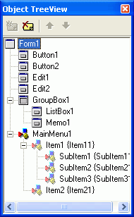

Во всем виноват 21 век
===


###### Зайцев Никита Алексеевич

<!-- *footer: Зайцев Никита Алексеевич (c) Москва, 2016 -->
<!-- page_number: true -->

---

<center><h1>ООП</h1></center>


---

Что же такое ООП?
===

## О - Объектно
## О - Ориентированное
## П - Программирование

---
<center>


</center>

---


---

<center>
Основные три кита
===


* ## Инкапсуляция
* ## Полиморфизм
* ## Наследование

</center>

---


---

Инкапсуляция
===

### Это процесс отделения друг от друга элементов объекта, определяющих его устройство и поведение; 

### инкапсуляция служит для того, чтобы изолировать контрактные обязательства абстракции от их реализации.

---

А если по-русски?
===

### Инкапсуляция скрывает детали реализации объекта.
---

---
---
Пример инкапсуляции Delphi
===
```delphi
  TMyClass = class
  private
    FMyField: Integer;
    procedure SetMyField(const Value: Integer);
    function GetMyField: Integer;
  public
    property MyField: 
    	Integer read GetMyField write SetMyField;
  end;
```

---
Полиморфизм
===
### способность скрывать множество различных реализаций под единственным общим именем или интерфейсом.
---


---
Наследование
===
### процесс приведения к одному значению одного или нескольких свойств разных объектов
---


---
Пример кода на Delphi
===
```delphi
//Родитель

TAncestor = class
private
protected
public
  // Виртуальная процедура
  procedure VirtualProcedure; virtual; abstract; 
  procedure StaticProcedure;
end;
```
```delphi
//Наследник

TDescendant = class(TAncestor)
private
protected
public
  // Перекрытие виртуальной процедуры
  procedure VirtualProcedure; override;
  procedure StaticProcedure;
end;
```
---
Семейство ООП
===

* ## Объект
* ## Класс
* ## etc...

---
Что такое объект?
===
### осязаемая сущность (tangible entity) — предмет или явление (процесс), имеющие четко выраженные границы, индивидуальность и поведение.
### Любой объект является экземпляром класса. 

---
Что такое класс(class)?
===
### это множество объектов, связанных общностью свойств, поведения, связей и семантики.
### это группа данных и методов(функций) для работы с этими данными.
<br>

<font color="red">**Золотое правило**:</font>

#### Объект зависит от класса. 
#### Т.е. нет класса = нет объекта ( но в Delphi все совершенно не так)

---
Что такое класс(class)?
===
### это множество объектов, связанных общностью свойств, поведения, связей и семантики.
### это группа данных и методов(функций) для работы с этими данными.
<br>

~~<font color="red">**Золотое правило**:</font>~~

#### ~~Объект зависит от класса.~~
#### ~~Т.е. нет класса = нет объекта~~ 
---
В чем мы будем работать?
===
<center>


</center>

---


---


---


---
<center>



</center>

---


---

Объекты в Delphi
===
* #### Объектами в Delphi являются элементы (кнопки, лэйблы)
* #### у объектов в Delphi есть свойства, которые управляются менеджером свойств (слайд 23)
* #### для каждого объекта есть собственное программируемое событие (event)

---

Моя первая программа
===
### Задача: Написать программу, которая будет вычислять длину строки по нажатию на клавишу расчет

## Порядок выполнения:
1. Создать форму
2. Добавить к форме кнопку и назвать её "расчет"
3. Добавить текстовое поле 
4. Добавить Label, который будет выводить результат
5. Написать код
6. ?????
7. PROFIT
---
Интерфейс программы
===


---

Event код
===
```delphi
procedure TForm1.Button1Click(Sender: TObject);
//Переменные, которые мы можем использовать
Var a : integer;
begin
//Тело программы
  a := Length(Edit1.Text);
  Label2.Caption := IntToStr(a);
end;
```

---
# Event код 
#### (без использования лишних переменных)
```delphi
procedure TForm1.Button1Click(Sender: TObject);
//Переменные, которые мы можем использовать
begin
//Тело программы
  Label2.Caption := IntToStr(Length(Edit1.Text));
end;
```
---
<center>


</center>

---
Работа со свойствами объектов
===
### Задача: Написать программа, которая будет приветствовать пользователя если он представился, а если нет, то попросить его об этом.
##### P.S. сохранять имя не нужно

---
Интерфейс
===


---
Event код
===
```delphi
procedure TForm1.Button1Click(Sender: TObject);
begin
Label2.Caption := Edit1.Text;
Label3.Visible := false;
Edit1.Visible := false;
Button1.Visible := false;
end;
```
---
<!-- page_number: false -->

