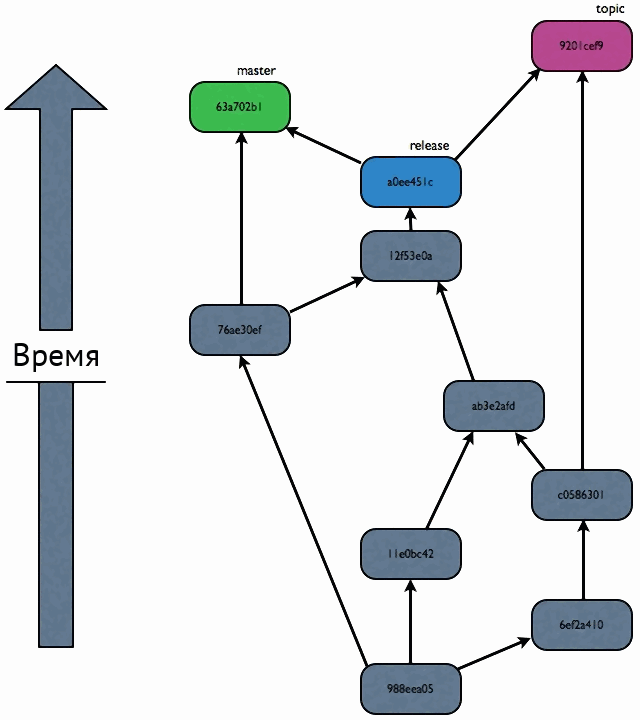
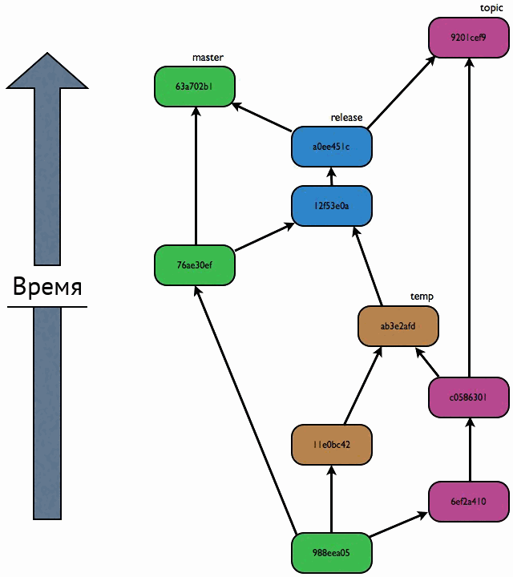
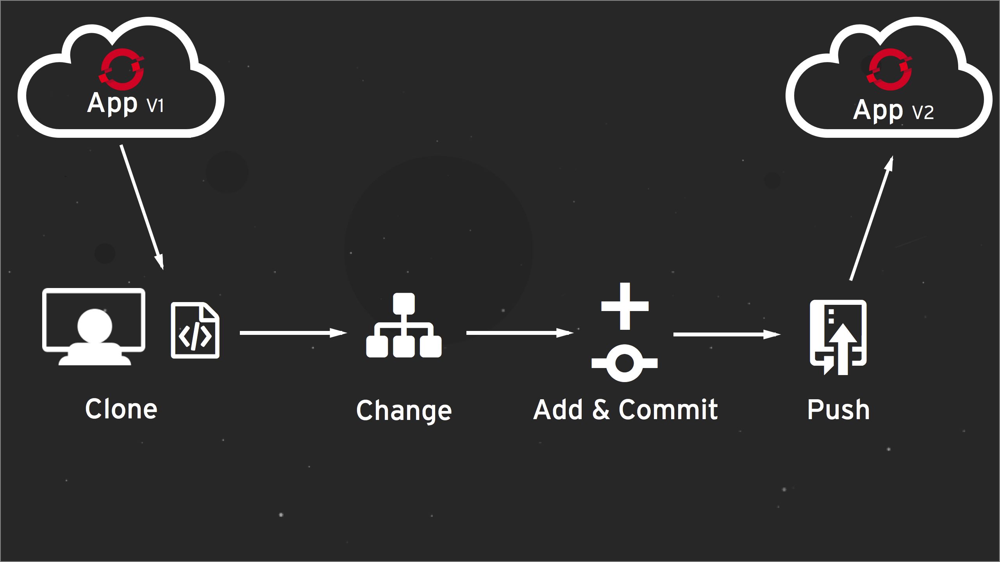
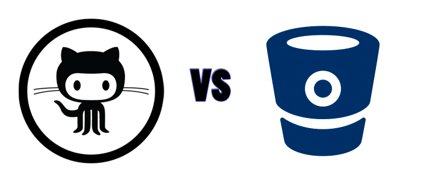

<!-- prerender: true -->

Давай, жми клаву!
===

### Зайцев Никита Алексеевич
создатель онлайн антивируса [Meteor Security](http://meteorsecurity.ru)

---

# Основная проблема - передача кода

---

Система контроля версий
===

---

Системы контроля версий
===

* ## Git
* ## Mercurial
* ## Subversion

---

В чем различия?
===

&nbsp;&nbsp;&nbsp; &nbsp;&nbsp;&nbsp;&nbsp;&nbsp;&nbsp;&nbsp;&nbsp;&nbsp;&nbsp;&nbsp;&nbsp;&nbsp;&nbsp;&nbsp;&nbsp;&nbsp;&nbsp;&nbsp;&nbsp;&nbsp;&nbsp;&nbsp;&nbsp;

## git &nbsp;&nbsp;&nbsp;&nbsp;&nbsp;&nbsp; mercurial

---

Что будем использовать мы?
===

----

---

Почему именно git?
===

---

Git это:
===
* ## Стильно
* ## Модно
* ## Молодежно
* ## Меня заставили

---

Как это работает?
===

---

Как установить?
===
* https://desktop.github.com/ с GUI от [GitHub](https://github.com)
* http://git-scm.com/download/win официальный GIT

---
Хостинги для git репозиториев
===
* ## Bitbucket
* ## Github
* ## Sourceforge
---
В чем отличия?
===

---
GitHub (https://github.com)
===
* ## Известность
* ## Удобные тарифные планы
* ## Современность
* ## Удобство

---
BitBucket (https://bitbucket.org)
===
* 