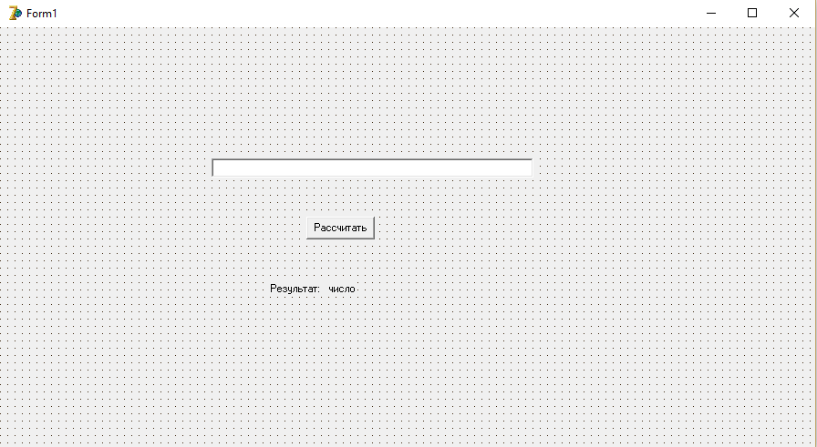

<!-- prerender: true -->


<font align="right">

Давай, жми клаву!
===

### Зайцев Никита Алексеевич
создатель онлайн антивируса [Meteor Security](http://meteorsecurity.ru)

</font>

---

<center>

# Основная проблема - передача кода

</center>

---

<center>

Система контроля версий
===

</center>

---

Системы контроля версий
===

* ## Git
* ## Mercurial
* ## Subversion

---


В чем различия?
===

&nbsp;&nbsp;&nbsp; &nbsp;&nbsp;&nbsp;&nbsp;&nbsp;&nbsp;&nbsp;&nbsp;&nbsp;&nbsp;&nbsp;&nbsp;&nbsp;&nbsp;&nbsp;&nbsp;&nbsp;&nbsp;&nbsp;&nbsp;&nbsp;&nbsp;&nbsp;&nbsp;

<center>

## git &nbsp;&nbsp;&nbsp;&nbsp;&nbsp;&nbsp; mercurial

</center>

---

Что будем использовать мы?
===

----


---

Почему именно git?
===

---

Git это:
===
* ## Стильно
* ## Модно
* ## Молодежно
* ## Меня заставили

---

Как это работает?
===


---

Как установить?
===
* https://desktop.github.com/ с GUI от [GitHub](https://github.com)
* http://git-scm.com/download/win официальный GIT

---
Хостинги для git репозиториев
===
* ## Bitbucket
* ## Github
* ## Sourceforge
* ## GitLab
* ## Google Code
* ## etc...
---

Популярные хостинги
===
* ## Bitbucket
* ## Github

---
В чем отличия?
===


---
GitHub (https://github.com)
===
* ## Известность
* ## Удобные тарифные планы
* ## Современность
* ## Удобство

---
BitBucket (https://bitbucket.org)
===
* ## Бесплатность
* ## Безлимитные приватные репозитории
* ## Сложность интерфейса
* ## Принадлежит Atlassian

---

Что выбираем мы?
===

---
Что выбираем мы?
===
* ## Безопасность
* ## Закрытость

---

Что выбираем мы?
===


---


---
Хорошо, решили. А как работать то?
===

* ### Каждое изменение должно сопровождаться "пушом"
* ### Не забывайте получать изменения в коде, сделанные вашими товарищами
* ### Что-то не получается? Открывай документацию и учи!

---
Основные команды
===
* ### `git init` - инициализировать готовый репозиторий
* ### `git push` - отправить изменения
* ### `git pull` - получить изменения
* ### `git checkout -b "имя ветки"` - создать ветку и перейти к ней
* ### `git merge "название ветки для слияния"` - слияние веток

---
Что такое ветка?
===

---
Для чего она нужна?
===

---
Алгоритмы ветвления и оператор выбора, циклы, обработка строк, массивов и файлов
===
---
Алгоритмы ветвления
===
```
if [(]<логическое выражение>[)] [then] 

<оператор 1> 

[else <оператор 2>]

```

---
Оператор выбора
===
### «На вход подается цифра, а на выходе должно быть название этой цифры».
---
Решение:
===
```delphi
readln(a); 
if a = 0 then writeln('ноль') else 
  if a = 1 then writeln('один') else 
    if a = 2 then writeln('два') else 
      if a = 3 then writeln('три') else 
        if a = 4 then writeln('четыре') else 
          if a = 5 then writeln('пять') else 
            if a = 6 then writeln('шесть') else 
              if a = 7 then writeln('семь') else 
                if a = 8 then writeln('восемь') else 
                  if a = 9 then writeln('девять');
```

---
Оператор выбора
===
```delphi
case <выражение> of 
  Значение1 [,значение11]: оператор1; 
  [Значение2 [,значение21]: оператор2;]
  [Значение3..значение5]: оператор3;]
  . . . 
  [else: операторElse1;] 
end;
```

---
_Верное_ решение
===
```delphi
Readln(a); 
Case a of 
0: writeln('ноль'); 
1: writeln('один'); 
2: writeln('два'); 
3: writeln('три');
4: writeln('четыре');
5: writeln('пять');
6: writeln('шесть');
7: writeln('семь');
8: writeln('восемь');
9: writeln('девять');
end;
```

---
Циклы
===

---
Циклы
===
* ## С предусловием
* 

---
Строки
===

* #### тип данных, значениями которого является произвольная последовательность (строка) символов алфавита. Каждая переменная такого типа (строковая переменная) может быть представлена фиксированным количеством байтов либо иметь произвольную длину.

* #### неограниченный массив символьного типа

---
Строковые функции
===

---
Функции преобразования
===
* #### `IntToStr(N: Integer): String` - преобразование числа в строку
* #### `StrToInt(S: String): Integer` - преобразование строки в число
* #### `FloatToStr(X: Extended): String` - преобразование числа с плавающей точкой в строку
* ### `StrToFloat(S: String): Extended` - преобразует строку в число с плавающей точкой

---
Функции преобразования
===
* `AnsiLowerCase(const S: String): String` - преобразование строки к нижнему регистру
* `AnsiUpperCase(const S: String): String` - преобразование строки к верхнему регистру
* `Length(const S: String): Integer` - измеряет длину строки
* `Trim(const S: String): String` - удаляет из строки начальные и завершающие пробелы и [управляющие символы](https://ru.wikipedia.org/wiki/%D0%A3%D0%BF%D1%80%D0%B0%D0%B2%D0%BB%D1%8F%D1%8E%D1%89%D0%B8%D0%B5_%D1%81%D0%B8%D0%BC%D0%B2%D0%BE%D0%BB%D1%8B)
* `TrimLeft(const S: String): String` - удаляет из строки **начальные** пробелы и управляющие символы
* `TrimRight(const S: String): String` удаляет из строки **завершающие** пробелы и управляющие символы

---
Функции сравнения
===
* `AnsiCompareStr(const S1, S2: String): Integer` - Сравнивает две строки S1 и S2 с учётом регистра символов.Возвращает значение < 0 если S1 < S2, 0 если S1=S2, > 0 если S1 > S2
* `AnsiCompareText(const S1, S2: String): Integer` - Сравнивает две строки S1 и S2 без учёта регистра символов. Возвращает значение < 0 если S1 < S2, 0 если S1=S2, >0 если S1 > S2

---
Прочие функции
===
* `Pos(Substr: String; Str: String): Integer` - поиск первого вхождения символа или строки.
* `Insert(Source: String; var S: String; Index: Integer): Integer` - вставка строки(символа) в строку начиная с **N** элемента
* `Delete(var S: String; Index, Count: Integer)` - удаление из строки **COUNT** символов начиная с **INDEX** позиции 
* ` Copy(S: String; Index, Count: Integer): String ` - копирует из строки подстроку начиная с **INDEX** номера на **COUNT** количество символов

---
Задача 1:
===
### Создать приложение, предлагающее пользователю ввести строку, определяющее количество символов в ней и выводящее результат, согласуя окончания различных падежей слова "символ" с числом симоволов, например: "В тексте 1 символ", "В тексте 32 символа", "В тексте 47 символов".

---
Примерный интерфейс
===


---
Код программы
===
```delphi
begin
N:=Length(Edit1.Text); //Определить число символов
Label2.Caption = 'В тексте ';
if N>20 then N:=N mod 10; //Вытащить последнюю цифру

case N of
	1 : S:=' символ';
    2..4 : S:=' символа';
    0,5..20 : S:=' символов';
end;
Label2.Caption:=Label2.Caption 
+ IntToStr(Length(Edit1.Text))+s;
end;
```


